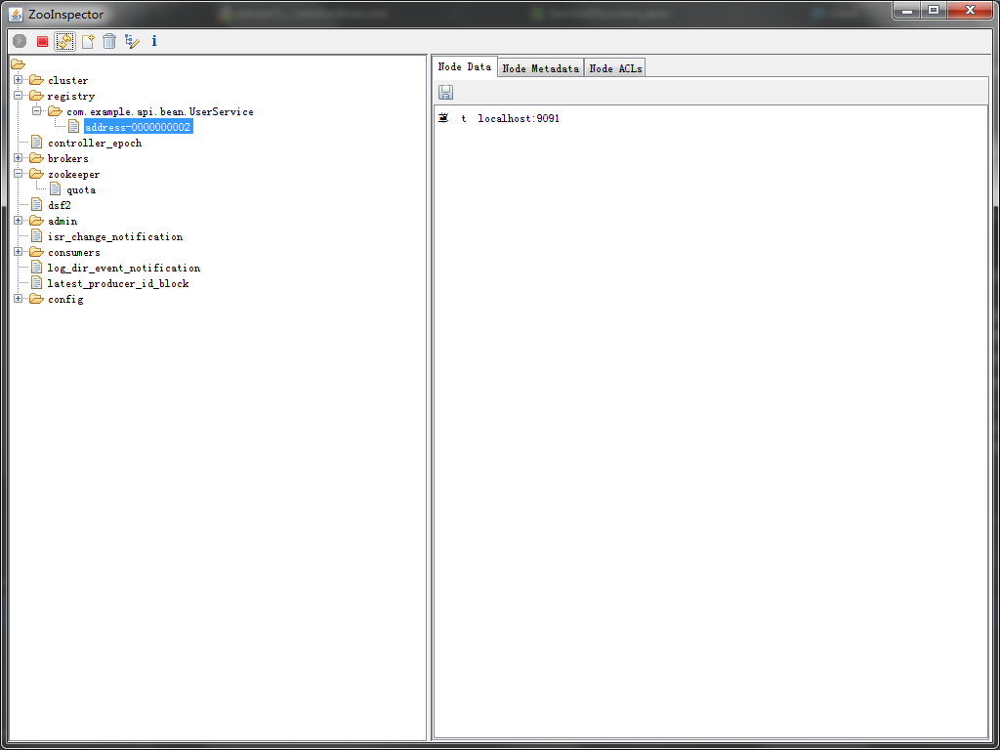

# rpc
rpc是一种设计思想:解决分布式之间的各个调用
- 动态代理
- 反射
- 序列化、反序列化
- 网络通信
- 编解码
- 服务发现和注册
- 心跳与链路检测

# rpc包功能
- rpc 提供了基于restTemplate和netty的传输方式,修改rpcServer.xml中的服务端bean来选择 同时使用不同的客户端代理方式

# register包功能
1. 使用zk作为注册中心,启动服务端之前先在本地启动zk，可以使用zooInspector观察注册到服务器上的节点信息
1. 

- 注册中心 ：保存所有服务的名字，服务提供者的IP列表，服务消费者的IP列表
- 服务提供者： 提供跨进程服务
- 服务消费者： 寻找到指定命名的服务并消费。
- ZkClient是一个开源的ZooKeeper客户端，是在原生的ZooKeeper API接口之上进行包装

# 负载均衡
